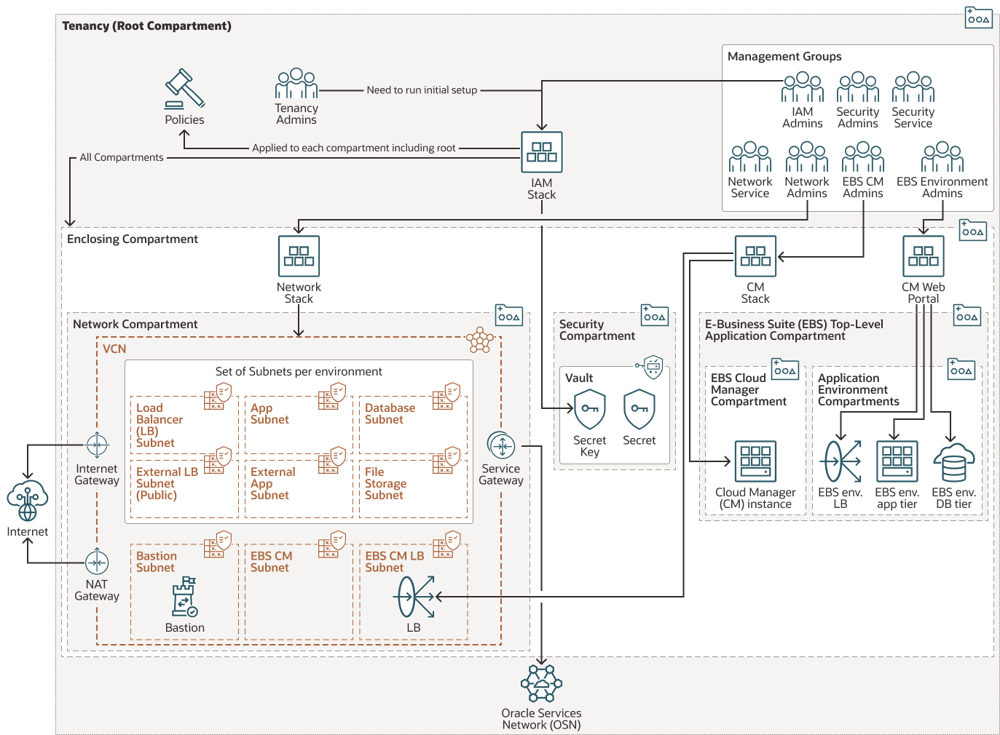

# EBS Cloud Manager

This Repository contains multiple stacks to deploy the EBS Cloud Manager and all OCI dependencies

# Beta Disclaimer
This code is still in development and being released internally for testing and feedback. Not all code branches have been tested and multiple feature requests are still being worked on,
## Please direct any questions/feedback to JB Anderson via one of these channels:
- slack: @jbander 
- email: jb.anderson@oracle.com
- orahub issue: https://orahub.oci.oraclecorp.com/a2c-app-innovators/a2c-cis-ebs-cloud-manager/-/issues

# Decision Guide/Prerequisites
Before deploying any infrastructure, you need to make several major decisions on how you want your environment set up
1. Infrastructure Management Philosophy
    - Are you committed to managing and maintaining TF stacks or do you want to use TF as a one off script and manage resources via console/cli? This determines the level of understanding your teams needs of TF and the specific stack code you will be running
    - How do you want to pass information between stacks? It is recommended to use Secrets. These stacks come with OCI Vault/KMS Secrets set up, but you can also use Hashicorps vault for secrets or opt to not use secrets and pass information via input variables or sharing output via state files
2. New or Existing tenancy
    - If this is a new Tenancy, there are several recommended identity and governance systems you will need to configure including creating user accounts and setting up tenancy-level personas to manage IAM, cred, auditors, announcements, and cost. This is in additon to the EBS resources defined in the existing tenancy.
    - If this is an existing Tenancy, identity resources are needed for networking, EBS application, and Security is recommended as well. You can create new ones with the IAM stack or reuse existing resources if they fit your needs and EBS requirements
3. IDCS or Identity Domains
    - OCI is currently in the process of upgrading Tenancys Identity Provider (IDP) from Identity Cloud Service (IDCS) to the new Identity Domains. You need to check if Identity Domains are enabled in your tenancy as the setup is slightly different for these services.
4. Public or Private Networking
    - Which Subnets, if any, do you want to expose to the public internet?
    - The cm app tier, ebs app tiers, and db tier subnets are given nat access.
    - The cm lb tier is given nat access, but can be modified to give full internet access.
    - The ebs lb tier only allows nat access. You can create ext_lb_app_tiers, which creates a public subnet for ext lbs
    - The bastion subnet is either given no internet access if you are using the bastion service or full internet access, which allows you to set up a traditional bastion VM yourself
5. OCI or externally managed DNS
    - These stacks assume you are leveraging your existing external DNS system, but can be modified to use OCI DNS
    - Whatever system you choose, you need to make sure the DNS is discoverable via your public or private LB subnets
6. OCI or externally managed Certificates
    - These stacks asume you are leveraging your existing external Certificate Authority, but can be modified to use OCI Cert service
7. Bastion Access
    - You may need to access your EBS cm, app tier, or DB tier instances via ssh for setup, maintaince, updates, and troubleshooting. There's several ways you can accomplish this:
    - Private Network access. If you connect your OCI VCN to on-prem or your office, you should be able to directly ssh into these instances. However, you may still want to set up a Bastion if your employees need access outside of the office or in case your private connection goes down
    - Bastion Service. OCI provides a bastion service that allows you to connect directly to private VMs without exposing a public IP and requires OCI authentication in order to create a session. This is the defaut option
    - Bastion VM. You can also opt for a public bastion subnet where you can set up a traditional bastion vm with a public IP. Setting up a traditional Bastion VM is not part of these terraform stacks
8. EBS Environments
    - the EBS cloud manager is designed to manage multiple EBS environments, so you only ever need one CM. However, there are two isolation steps you may want to take depending upon your needs. These are orthogonal to each other, so you could have several identity environments sharing the same network environment or vice versa. By default though, these will match 1 to 1
    - Identity Isolation. You can create a seperate persona (compartment, group, policy) for each EBS environment or to seperate Prod and non-prod. This will also restrict users access in the CM UI to only the environment groups they have OCI IAM access to
    - Network Isolation. You can create a seperate set of subnets (lb, app, db) for each EBS environment or to seperate Prod and non-prod
9. Naming Convention
    - These stacks share a naming convention, which allows them to easily share information via secrets. You can change the defaults, but make sure you use the same names across all of your ebs stacks. using different names for these variables across your stacks will cause errors unless you manually specify the secrets to use.
    - lz_prefix - this is the prefix used to identify what landing zone you are using. Multiple workloads can share a landing zone (network and security compartments) or use different landing zones depending upon your organizations internal structure
    - ebs_workload_prefix - this is the prefix used to identify a workload or application. Each workload has it's own isolated compartment.
    - ebs_workload_environment_name(s) - this is the name(s) that identifies the environment(s) to use/create. Some stacks allow you to create resources for multiple environment names by listing them, while others can only create the resources for one environment per stack instance

# Stack and Deployment Overview
These stacks need to be deployed in a specific order. However, they are modular enough that you can pick and choose which stacks you use as long as you already have created resources that can fullfill the EBS requirements. You can use the terraform cli to run these stacks, but it is recommended to run through Resource Manager if you don't need to customize the stacks beyond the variables given. Currently, many of the advanced option variables are not fully implemented and should only be used by expert users

Click the Deploy to OCI button here which will import the stack into your tenancy.

TODO: this zip file needs to be updated/a better system to deploy these stacks. Maybe multiple buttons - one for each stack

1. TenancyIAMStack
    - Creates the necessary Identity Resources for EBS in a CIS compliant manner
    - Compartments for Security, Network, EBS workload, and each EBS environment
    - Each compartment comes with a group and policy to facilitate simple RBAC. Users will need to be manually added to these groups or mapped from a federated identity provider
2. EBSNetworkStack
    - Creates a vcn and subnets necessary for EBS
    - You will need to run multiple copies of this stack if you want multiple EBS network environments
3. Identity Configuration
    - This cannot currently be automated via terraform resources. Will need to create direct IAM user if not one already and register EBS CM as a confidential application via the console.
    - Instructions differ based on if your tenancy has Identity Domains enabled or if it still uses IDCS
    - https://docs.oracle.com/cd/E26401_01/doc.122/f35809/T679330T679339.htm#cmg_deploy_createuserswoid
    - https://docs.oracle.com/cd/E26401_01/doc.122/f35809/T679330T679339.htm#cmg_deploy_register_tenanciesiamwoid
4. EBSCMStack
    - Creates the CM VM and Load Balancer as well as CM app bootstrapping

# Standard Deployment Instructions

## Tenancy IAM Stack

TODO: list variables and suggested configs

## EBS Network Stack

TODO: list variables and suggested configs

# Identity Configuration

TODO: write instructions on checking for direct IAM user and creating one if needed

TODO: write/copy instructions for creating confidential apps in IDCS and Identity Domains

# EBS CM Stack

TODO: list variables and suggested configs

# Advanced Deployment Overview

git gud
TODO: list the advanced options for each stack and indicate if they are fully supported and tested

# Other Stacks
You can ignore these folders
- EBSDemoStack
    - current marketplace release of EBS CM for demo stacks. Used for reference during development and will be removed later
- ebs-stacks-layout
    - sample RM schemas used for reference during development and will be removed later

# Sample Deployment Architecture
not representative of final architecture or what is currently deployable

TODO: update arch and possibly make several to represent different common deployments

# Sample BOM
not representative of final costs for your workload. Please contact an Oracle Architect or Engineer for a tailored BOM

TODO: link/create sample BOM

# Docs

More EBS collateral can be found in this oradocs folder: https://oradocs-prodapp.cec.ocp.oraclecloud.com/documents/folder/F52E7A6B2E6AE691952B36498BC9247F22829DFC9A4E/_EBS_to_Oracle_Cloud
 - the killer demo consolidated script will get you quick access to the CM ui where you can demo creating environments

EBS Cloud Manager Guide
https://docs.oracle.com/cd/E26401_01/doc.122/f35809/toc.htm

Getting Started with EBS on OCI
https://support.oracle.com/epmos/faces/DocumentDisplay?_afrLoop=115635672225926&parent=DOCUMENT&sourceId=2517025.1&id=2517025.1&_afrWindowMode=0&_adf.ctrl-state=oko2ohs23_4

Lift and Shift On-Prem EBS to OCI Workshop
https://apexapps.oracle.com/pls/apex/dbpm/r/livelabs/view-workshop?p180_id=672

# TODO: below this is the devrel template README

# EBS-Landing-Zone

 

## THIS IS A NEW, BLANK REPO THAT IS NOT READY FOR USE YET.  PLEASE CHECK BACK SOON!

## Introduction
MISSING

## Getting Started
MISSING

### Prerequisites
MISSING

## Notes/Issues
MISSING

## URLs
* Nothing at this time

## Contributing
This project is open source.  Please submit your contributions by forking this repository and submitting a pull request!  Oracle appreciates any contributions that are made by the open source community.

## License
Copyright (c) 2022 Oracle and/or its affiliates.

Licensed under the Universal Permissive License (UPL), Version 1.0.

See [LICENSE](LICENSE) for more details.

ORACLE AND ITS AFFILIATES DO NOT PROVIDE ANY WARRANTY WHATSOEVER, EXPRESS OR IMPLIED, FOR ANY SOFTWARE, MATERIAL OR CONTENT OF ANY KIND CONTAINED OR PRODUCED WITHIN THIS REPOSITORY, AND IN PARTICULAR SPECIFICALLY DISCLAIM ANY AND ALL IMPLIED WARRANTIES OF TITLE, NON-INFRINGEMENT, MERCHANTABILITY, AND FITNESS FOR A PARTICULAR PURPOSE.  FURTHERMORE, ORACLE AND ITS AFFILIATES DO NOT REPRESENT THAT ANY CUSTOMARY SECURITY REVIEW HAS BEEN PERFORMED WITH RESPECT TO ANY SOFTWARE, MATERIAL OR CONTENT CONTAINED OR PRODUCED WITHIN THIS REPOSITORY. IN ADDITION, AND WITHOUT LIMITING THE FOREGOING, THIRD PARTIES MAY HAVE POSTED SOFTWARE, MATERIAL OR CONTENT TO THIS REPOSITORY WITHOUT ANY REVIEW. USE AT YOUR OWN RISK. 